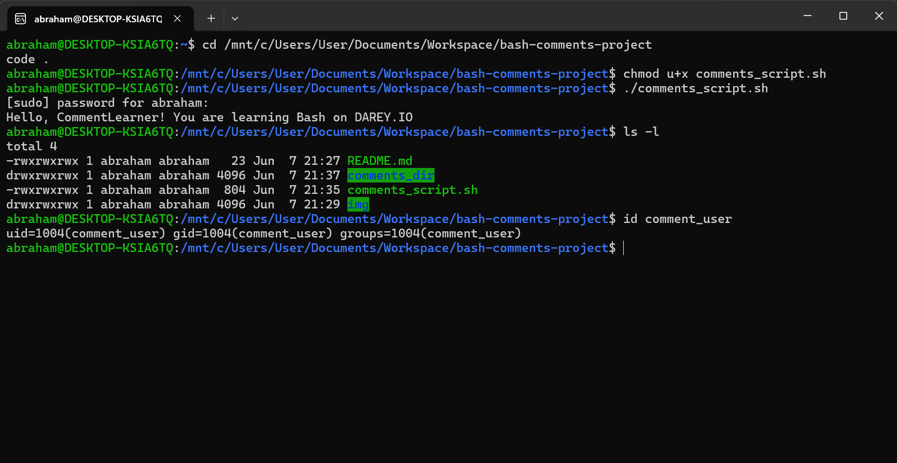

# Adding Comments in Bash Scripts

## Project Overview
This project explores adding comments in Bash scripts to enhance readability and maintainability, executed on a local Ubuntu environment (WSL) with VS Code installed via Ubuntu.

## Setup
- Created a new GitHub repository and cloned it to ~/Documents/Workspace/bash-comments-project on Jun 07, 2025, 21:14 PM WAT.
- Used Ubuntu terminal (WSL) with VS Code installed via Ubuntu, accessing the Windows repository at /mnt/c/Users/YourUsername/Documents/Workspace/bash-comments-project.

## Script Execution

### Creating and Commenting the Script
- **Edit Script with VS Code**:
  - Command: `code comments_script.sh`
  - Purpose: Created and edited the script in VS Code.
  - Added comments and code:
    ```bash
    #!/bin/bash

    # This script demonstrates the use of comments in Bash
    # Purpose: Showcase single-line and multi-line comments for better code readability

    # Create a directory for project organization
    mkdir comments_dir  # Initializes a directory named 'comments_dir'

    # Add a test user for demonstration purposes
    sudo useradd comment_user  # Creates a new user 'comment_user' with elevated privileges

    # Multi-line comments for complex logic
    # This section tests variable functionality
    # Variables enhance script dynamism
    name="CommentLearner"  # Defines a variable 'name' with the value "CommentLearner"
    echo "Hello, $name! You are learning Bash on DAREY.IO"  # Outputs a personalized welcome message

    # Best practice: Comment only non-obvious sections
    # Future enhancement: Add a loop for multiple users
    ```
  - Purpose: `#` starts single-line comments ignored by Bash; multi-line comments use `#` per line; best practices focus on clarity and relevance.
- **Add Execute Permission**:
  - Command: `chmod u+x comments_script.sh`
  - Purpose: `chmod u+x` grants the owner execute permission.
- **Run Script**:
  - Command: `./comments_script.sh`
  - Purpose: Executes the script; `sudo` may prompt for a password.
  - Verification: `ls -l` shows `comments_dir`; `id comment_user` confirms user (WSL may require `sudo passwd comment_user`).
  - **Screenshot**: Script run with output:

    

## Tools Used
- **Ubuntu Terminal (WSL)**: For script execution with VS Code installed via Ubuntu.
- **VS Code**: For editing the script and `README.md`.
- **Git Bash**: For managing the Git repository on Windows.
- **GitHub**: For hosting the project.

## Lessons Learned
- Comments with `#` improve script understanding by explaining the “why” behind code.
- Multi-line comments using `#` are effective for complex sections.
- Overcommenting should be avoided; focus on non-obvious logic.

## Repository Link
[GitHub Repository](https://github.com/westgrin/bash-comments-project)

## Conclusion
This project strengthened my skills in adding meaningful comments to Bash scripts, adhering to best practices.